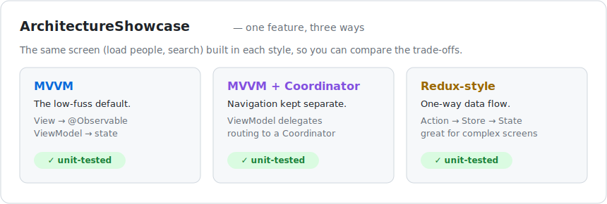

# iOS Architecture Showcase

  

The **same small feature** — load a list of people and search it — built **three different ways**. It's a side-by-side reference for how to structure an app's code, and why you might pick one style over another.

## Why it exists

Good apps keep their code organised so it's easy to change and test. There are a few popular ways to do that. This project shows each one solving the exact same problem, so you can compare them fairly.

The three styles (each in its own folder):

- **MVVM** — the common, low-fuss default.
- **MVVM + Coordinator** — MVVM with screen-to-screen navigation kept separate.
- **Redux-style** — all changes flow through one place; great for complex screens.

## How to open and run it

You need a Mac with **Xcode** (free on the Mac App Store).

1. Download this folder (**Code → Download ZIP**, then unzip), or clone it.
2. Double-click **`Package.swift`** to open it in Xcode.
3. Press **⌘U** to run the tests for all three styles.

Terminal alternative: `swift test`.

## What's inside

- `Sources/Domain` — the shared data both used by every style.
- `Sources/MVVMFeature`, `Sources/MVVMCoordinatorFeature`, `Sources/ReduxFeature` — the three versions.
- `Tests/…` — tests for each version.

## License

MIT — free to use. See [LICENSE](LICENSE).
